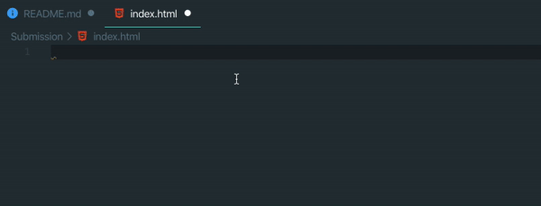
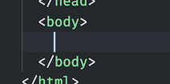
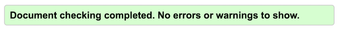

# 01 Exercise - Make a website using HTML

Create a website with multiple pages using HTML

---

## Brief

Build a website using HTML. The website can be on any topic you like, otherwise make a blog about the city you live in, with articles about your favourite sights and eateries.

Your website should include:

- Ordered and Unordered lists
- At least two different pages
- Links to these pages
- Link to other websites on the internet
- Images
- HTML Headings down to the heading 3 level `<h3></h3>`

---

## Rationale

Every webpage is written in HTML, making it crucial for web developers to have a good understanding of how to write HTML, and what elements to use when marking up a document.

Although web developers are not expected to remember every HTML element, they must know how to use internet resources to find the information they need.

Web developers must have an understanding of how to build a website with multiple pages, and [how to link them together](https://developer.mozilla.org/en-US/docs/Learn/HTML/Introduction_to_HTML/Creating_hyperlinks). This includes using relative links to link to pages within your own website, and absolute links to link to other websites on the internet.

---

## Getting Started

1. Accept the exercise with the exercise link from the class notes.
2. `clone` to your local computer using VS Code or the Terminal.
3. The code for this exercise should go into the `/Submission` folder.

---

## Instructions Part A - Create your first HTML file

We will start by building an index page, with the elements that will be shared across all your pages.

1. In the `Submission` folder, create a new file, `index.html`. You can do this in VS Code, by opening File Explorer, and right-clicking on the `Submission` folder, then choosing `New File`.
2. Open `index.html` by double-clicking it. You should have an empty file.
3. Open your new file, and build the base of your HTML page, including the `html`, `head`, and `body` tags. You can use the Emmet plugin that is built into VS Code to do this quickly, by typing `!` and then `tab`

   

   - Reference [Anatomy of an HTML document](https://developer.mozilla.org/en-US/docs/Learn/Getting_started_with_the_web/HTML_basics#Anatomy_of_an_HTML_document)

4. Make sure your cursor is in the correct place in your HTML document, between the `body` tags.

   

5. Add some content to your webpage, such as an `h1` heading. Refer to the checklist in the brief and acceptance criteria and ensure you include all of the elements.

   ```html
   <h1>My website!</h1>
   ```

6. Open `index.html` using the Live Server, and see how it looks
7. Commit your changes to git

**Acceptance criteria**

- Your website includes Headings, Lists, Images and links
- Headings go down to the third level (`<h3>`)
- There are at least two pages that are linked to each other
- Not have errors when validated using the [W3C HTML Validator](https://validator.w3.org/#validate_by_input)

  

---

# Submit your Exercise

- [ ] Ensure all the links work on your website
- [ ] Check HTML has no errors in the HTML Validator
- [ ] Push your code to GitHub by typing `git push`
- [ ] "Mark as done" in Google Classroom

---

# Solution video

[Walkthrough Video](https://www.loom.com/share/b23370248ceb44c78db97d608f107e09)
